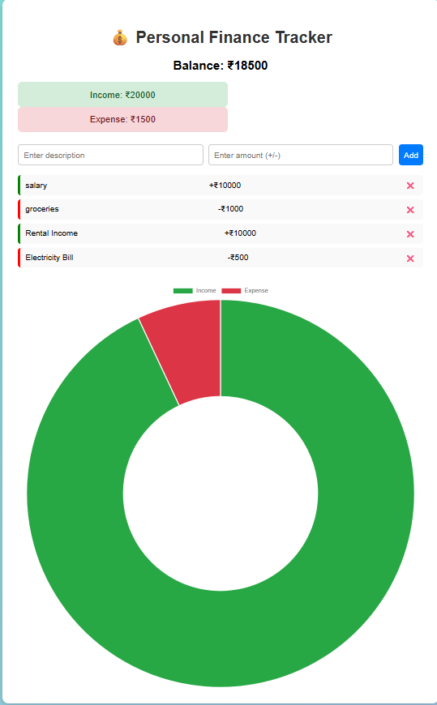

💰 Personal Finance Tracker

A responsive web application to help users track income and expenses and manage personal finances effectively. Users can add transactions with a description and amount, view real-time balance updates, and see income vs expense visualized through interactive charts. Data is stored in localStorage, so transactions persist even after refreshing the page.

Features:
- Add income and expense transactions with description and amount
- Real-time balance calculation
- Visualize income vs expense with doughnut charts using Chart.js
- Responsive and user-friendly interface
- Data persistence using localStorage
- Optional: delete transactions if needed

Technologies Used:
- HTML5 – Structure  
- CSS3 – Styling and responsive design  
- JavaScript – Functionality and dynamic updates  
- Chart.js – Interactive chart visualization  
- LocalStorage – Client-side data persistence  

Demo:

[Live Demo](https://PriyankaAithagoni.github.io/finance-tracker/)

Screenshot:

  

How to Use:
 1. Enter a description for the transaction (e.g., Salary, Groceries, Bills).  
 2. Enter an amount:  
   - Positive numbers → Income  
   - Negative numbers → Expense  
 3. Click Add → Transaction will appear in the list, balance will update, and chart will reflect changes.  
 4. Transactions are stored locally, so they remain even after refreshing the page.  
 5. Optional: Click ❌ next to a transaction to delete it.  

 GitHub Repository:
[https://github.com/PriyankaAithagoni/finance-tracker]

